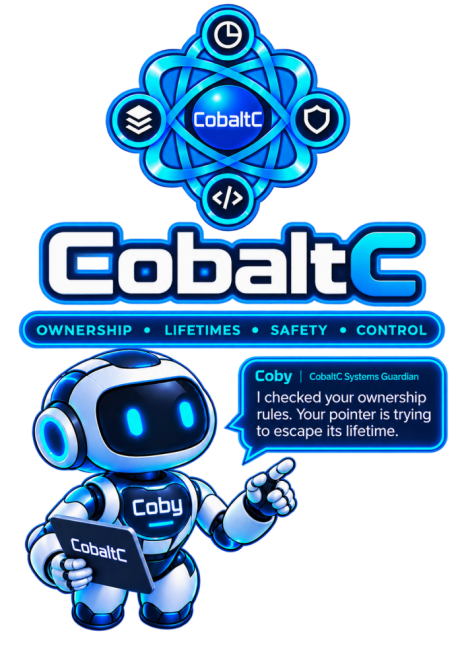

This is the official home of the CobaltC language specification, interpreter (coby) and compiler (cobc).

CobaltC is an AI designed (using additional human input and direction where needed) statically typed systems programming language providing explicit ownership, deterministic destruction, compiler-checked borrowing, inferred lifetimes, explicit nullability, bounds-safe operations, structured error handling, safe concurrency, explicit unsafe operations, and explicit foreign-function interfaces.

Although it is still experimental at this stage, the language is intended for software requiring predictable resource management, strong memory safety, native execution, and controlled interaction with low-level facilities.

Commit Update 13, 2026-09-26 15:20 UTC. The repository is kept as a single commit that each update replaces, so this line, rather than the history, says when that last happened.

The language specification is available [here](https://github.com/strawberry9/CobaltC/tree/main/spec)

NOTE: The language specification is intentionally designed by AI for AI consumption rather than human consumption.

For human consumption, a language guide and reference is available [here](https://strawberry9.github.io/the-wrong-memory/Appendix_06.html); its source is primarily from `htmlguide/index.html` in this repository, regenerated from `htmlguide/generator/` (every example in it is checked against both the interpreter and the compiler).

The language guide is updated as soon as new language features arrive (which currently, is often).

The showcase examples (see further below) are also updated as soon as new language features arrive.

## What is in the repository

- `spec/` — the language specification: numbered normative artifacts, decision records (`spec/decisions/`), change records (`spec/changes/`), the diagnostic and feature registries, the conformance table, and the examples.
- `impl/` — a Cargo workspace with two implementations of the language and one runtime:
  - `coby`, the reference interpreter: a tree-walking evaluator that executes the specification's rules directly over an abstract state (`impl/src/`).
  - `cobc`, a native compiler for x86_64 Linux: the same front end as `coby`, then a lowering to C compiled by the system `cc` (`impl/cobc/`).
  - `cbrt`, the runtime every compiled program links: it keeps the checks the specification discharges at run time — access paths, aliasing, temporal validity, resource destruction — over real addresses (`impl/cbrt/`).
- `impl/conformance/` — the file-based conformance suite; `impl/cobaltc_examples/` — small example programs; `htmlguide/` — the human-readable guide and its generator.
- `showcase/` — complete example programs chosen to show what is particular to CobaltC; `showcase/README.md` describes them all.
- `bench/` — the compiler measured against Rust on two compute-heavy workloads, with a script that reproduces the numbers; the results are in `bench/RESULTS.md`, and `bench/README.md` explains them.
- `impl/STATUS.md` records exactly what each implementation does and does not do; `impl/COBC-PLAN.md` is the compiler's plan and its milestone record.

## Building (debug and release)

Everything is a standard Rust Cargo workspace with no dependencies outside the Rust standard library; the compiler additionally needs a C compiler (`cc`) on the path.

Developed and verified on:

- Ubuntu 22.04 LTS on x86_64 (Linux 6.8), with `cc` = GCC 11
- Rust 1.98.1 with Cargo 1.98.1, installed from https://rustup.rs

The interpreter goes through the standard library for everything platform-facing (the `write` extern writes raw bytes to standard output; threads are `std::thread`), so `cargo build -p coby` works unchanged on Windows, where its full test suite has also been run and passes. The one exception is calling C: coby's `extern fn` calls follow the x86-64 Linux calling convention, so on Windows it refuses them (`unsupported: …`, exit status 3), and the test suites skip the cases that make such a call, saying so. The compiler however, currently targets x86_64 Linux only. macOS and other Linux distributions are expected to work but have not been tried.

```
cd impl
cargo clean                        # optional: start from a clean build
cargo build --workspace
cargo build --release --workspace
```

This writes `coby`, `cobc`, and the runtime library `libcbrt.a` to `impl/target/debug/` and `impl/target/release/`.

`cobc` links every program against the `libcbrt.a` that sits beside its own executable. Only a build that includes the `cbrt` package writes that file, so the flags above matter:

| Command (in `impl/`) | `coby` | `cobc` | `libcbrt.a` |
|---|---|---|---|
| `cargo build --workspace` | built | built | built |
| `cargo build` | built | — | — |
| `cargo build -p cobc` | — | built | — |
| `cargo test --workspace` | built | built | **not written** |

- `cargo build` with no flags builds only `coby`, because `impl/Cargo.toml` is the interpreter's own package as well as the workspace root.
- `cargo build -p cobc` builds a compiler that cannot link anything. It fails with `libcbrt.a not found in …`, or quietly uses an old `libcbrt.a` left by an earlier build. To build only the compiler, use `cargo build -p cbrt -p cobc`.
- Old binaries left in `target/` are never flagged as out of date: an old `coby`, `cobc`, or `libcbrt.a` still runs. After pulling changes, rebuild with `--workspace` (in each profile you use) before running anything from `target/`.

## Testing (debug and release)

```
cd impl
cargo build --workspace && cargo test --workspace
cargo build --release --workspace && cargo test --release --workspace
```

Always build before testing. `cargo test` never writes the runtime's static library (`libcbrt.a`), which the compiled suites link. Testing alone therefore compiles every program against whatever `libcbrt.a` the last build left, which may be older than the runtime's source, or it fails if there is none. It does rebuild `cobc` itself, so a stale runtime paired with a fresh compiler shows up as confusing link or run-time failures rather than as a build error.

The compiler's suites compare each compiled program's output with the interpreter's, and they build the `coby` executable themselves (in the profile being tested) before using it. That makes `cargo test -p cobc` on its own safe from a stale interpreter, but not from a stale `libcbrt.a`.

This runs the interpreter's suites (the inline conformance tests, the file-based suite, every row of the specification's conformance table, every example) and the compiler's: the same file suite, examples, and every conformance row compiled and run by `cobc --run`, each compared with the interpreter's outcome, phase, standard output, and error output (the diagnostic, its location included).

Every compiled test is compiled twice, with GCC and with Clang (`cobc --cc`), and both must match the interpreter: C that one compiler accepts but the other reads differently shows up as a failure, as a bare `-9223372036854775808` once did. Both compilers must be installed (Ubuntu: `sudo apt install gcc clang`); a missing one fails the suites with that message. `COBC_TEST_CCS` chooses others, e.g. `COBC_TEST_CCS=gcc cargo test --workspace` for GCC alone. The showcase runner and the guide's example checker do the same, with `COBC_CCS`.

The compiler's suites also run a differential test: random, well-typed programs, each run by `coby` and compiled by `cobc` with each C compiler, which must all agree on exit status, standard output, and error output. The programs exercise the checks the compiler proves unnecessary or makes cheaper: vector pushes and element accesses, element references held across reallocation, reference parameters, moves, resources ending in nested blocks, and arithmetic that may fault. By default 100 programs run from a fixed seed. For a longer run, from another seed:

```
cd impl
COBC_DIFF_N=2000 COBC_DIFF_SEED=7 cargo test --release -p cobc --test differential -- --nocapture
```

A program they disagree on is kept in `impl/target/differential-failures/`, and the failure names the C compiler.

## Running a program

Both binaries (`coby` and `cobc`) take the program's entry file, which may declare modules whose bodies are other files (`module m "./m.cb";`, `spec/17` §5). Whatever follows the file is passed to the program as its arguments: `coby prog.cb a b` and `cobc --run prog.cb a b` both give it `a` and `b`, which it reads with `arg_count()` and `arg(i)` (`spec/21` §2c). Argument 0 is `a`, not the program's name.

The standard library (`Vec`, `String`, `HashMap`, `HashSet`, `Rc`, `Option`, `Result`, `printf`, …) is the module `std`; a program uses it by beginning with `import std;` (`spec/21` §0).

```
./target/release/coby cobaltc_examples/12_collatz.cb          # interpret
./target/release/cobc --run cobaltc_examples/12_collatz.cb    # compile to a temporary directory and run
./target/release/cobc -o collatz cobaltc_examples/12_collatz.cb   # keep the executable (--keep-c keeps the C too)
./target/release/coby --about                                  # what the interpreter is, next to the compiler
./target/release/cobc --about                                  # and the compiler, next to the interpreter
```

`cobc` passes `-O2` to `cc` by default; `-O LEVEL` (`0`–`3`, `s`, `g`) replaces it, and `-march=CPU` (e.g. `-march=native`) targets a specific processor, at the cost of the executable possibly not running on an older one. `--cc COMPILER` uses another C compiler, such as `clang`, in place of `cc`; which is faster depends on the program (`bench/RESULTS.md`). `cobc --help` describes every option.

A program that runs to completion exits with status 0, or with `main`'s value if it is declared `fn main() : u8` (`spec/15` §7); its destructors have all run by then. A program the specification rejects prints the diagnostic, the phase it was caught in (`static` or `dynamic`), the rule it violated and the `file:line`, then exits with status 1 — identically from either binary, since both render from the same registry. Setting `COBALTC_TRACE=1` makes the interpreter print where a rejection came from. Either binary exits with status 3 and `unsupported: …` for a construct it cannot handle: the compiler does not compile a thread whose result is a reference, or a generic function used as a value with nothing to fix its type arguments (`auto f = id;`); the interpreter cannot pass a raw pointer to a C function, since its memory is simulated. Both read and write files, whole (`read_file`, `write_file`, `read_bytes`, `write_bytes`) or through an open `File`, and read standard input (`read_line`, or `std`'s `read`). `extern fn` declarations call real C functions from libc and libm in both (x86-64 Linux). A program can also name its own C code or an installed library with `extern "./mine.c";` or `extern "z";`; only the compiler links it, so the interpreter stops at the first call into it.

## Compiler status

All three planned stages of the compiler are complete. Every conformance row, file case, and example — concurrency included (`spawn`, `join`, `mutex`) — compiles to the interpreter's exact outcome, phase, and output (174 of 174 rows, 208 of 208 cases, 13 of 13 examples), as do all 91 runnable examples in the guide. Compiled threads are real OS threads that run in parallel; every access to memory two threads can reach is checked by the runtime, under its lock, before it happens. The compiled program performs every check the specification discharges dynamically, which is what makes it conforming; it skips only checks that provably cannot fail. A release build runs the memoised-search example about two hundred times as fast as the interpreter, and compute-bound threads scale across cores. The plan, its measurements and its decisions are in `impl/COBC-PLAN.md`; `impl/STATUS.md` records exactly what each implementation does.

License

Copyright © 2026 strawberry9.

This repository contains software and other creative content, which are licensed separately.

Source Code

Unless otherwise stated, all source code in this repository is licensed under the BSD 3-Clause License.

See LICENSE for the full license text.

Documentation and Creative Content

Unless otherwise stated, the documentation, language specification, written content, images, graphics, and other original creative content in this repository are licensed under the Creative Commons Attribution-NonCommercial-NoDerivatives 4.0 International License (CC BY-NC-ND 4.0).

This means you may share the licensed content for non-commercial purposes, provided that you give appropriate attribution and comply with the license terms. You may not distribute modified versions of the licensed content.

See LICENSE-CC-BY-NC-ND for the complete license text.

Full license:
https://creativecommons.org/licenses/by-nc-nd/4.0/

Third-Party Content

Third-party materials included in this repository may be subject to their own licenses and terms. Such materials are not necessarily covered by either license above. Where applicable, their respective licenses and attribution notices are provided alongside the relevant materials.
