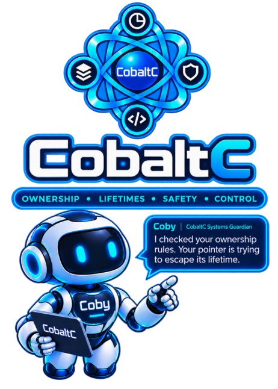

This is the official home of the CobaltC programming language specification (CobaltC), the interpreter (coby), the native compiler (cobc), and the code formatter (cobfmt).

CobaltC is an AI designed (using additional human input and direction where appropriate) statically typed systems programming language providing explicit ownership, deterministic destruction, compiler-checked borrowing, inferred lifetimes, explicit nullability, bounds-safe operations, structured error handling, safe concurrency, explicit unsafe operations, and explicit foreign-function interfaces.

The language design emerged from an exploration of C's memory-safety flaws, examined in the free online open-source book and essay collection: [The Wrong Memory](https://strawberry9.github.io/the-wrong-memory/cover.html)

CobaltC is a language that is committed to making the facts needed for systems safety explicit, and to tying implementation decisions back to stable normative rules. A distinctive choice is that the language can allow a source program whose access cannot be proved safe statically, while requiring a dynamic diagnostic instead of permitting memory-unsafe execution.

Although it is still experimental at this stage, the language is intended for software requiring predictable resource management, strong memory safety, native execution, and controlled interaction with low-level facilities.

This CobaltC project began on 19 September 2026, based on the instructions provided by the project owner, as set out in [CobaltC_Master_Instructions.md](CobaltC_Master_Instructions.md).

Commit Update 99, 2026-10-10 23:15 UTC. Specification edition 2026.101009. The repository is kept as a single commit that each update replaces, so this line, rather than the history, says when that last happened; the edition, recorded in [spec/README.md](spec/README.md), changes only when the specification does.

The language specification (which is already well developed, but not yet final) is available [here](https://github.com/strawberry9/CobaltC/tree/main/spec)

NOTE: The language specification is intentionally designed by AI for AI consumption rather than human consumption.

For human consumption, a language guide and reference is available [here](https://strawberry9.github.io/the-wrong-memory/Appendix_06.html); its source is primarily from `htmlguide/index.html` in this repository, regenerated from `htmlguide/generator/` (every example in it is checked against both the interpreter and the compiler).

The language guide is updated as soon as new language capabilities arrive (which currently, is often).

The showcase examples (see further below) are also updated as soon as new language features arrive.

## What is in the repository

- `spec/` — the language specification: numbered normative artifacts, decision records (`spec/decisions/`), change records (`spec/changes/`), the diagnostic and feature registries, the conformance table, and the examples.
- `impl/` — a Cargo workspace with two implementations of the language, one runtime and a formatter:
  - `coby`, the reference interpreter: a tree-walking evaluator that executes the specification's rules directly over an abstract state (`impl/src/`).
  - `cobc`, a native compiler for x86_64 Linux: the same front end as `coby`, then a lowering to C compiled by the system `cc` (`impl/cobc/`).
  - `cbrt`, the runtime every compiled program links: it keeps the checks the specification discharges at run time — access paths, aliasing, temporal validity, resource destruction — over real addresses (`impl/cbrt/`).
  - `cobfmt`, the code formatter: it rewrites `.cb` files into the house style of the guide, the showcases and the examples, changing only layout, never a token (`impl/cobfmt/`).
- `impl/conformance/` — the file-based conformance suite; `impl/cobaltc_examples/` — small example programs; `htmlguide/` — the human-readable guide and its generator.
- `showcase/` — complete example programs chosen to show what is particular to CobaltC; `showcase/README.md` describes them all.
- `bench/` — the compiler measured against Rust on two compute-heavy workloads, with a script that reproduces the numbers; the results are in `bench/RESULTS.md`, and `bench/README.md` explains them.
- `impl/STATUS.md` records exactly what each implementation does and does not do; `impl/COBC-PLAN.md` is the compiler's plan and its milestone record.

## Building (debug and release)

Everything is a standard Rust Cargo workspace with no dependencies outside the Rust standard library; the compiler additionally needs a C compiler (`cc`) on the path.

Developed and verified on:

- Ubuntu 22.04 LTS on x86_64 (Linux 6.8), with `cc` = GCC 11
- Rust 1.98.1 with Cargo 1.98.1, installed from https://rustup.rs

The interpreter goes through the standard library for everything platform-facing (the `stdout_write` extern writes raw bytes to standard output; threads are `std::thread`), so `cargo build -p coby` works unchanged on Windows, where its full test suite has also been run and passes. The formatter, `cobfmt`, is built the same way, uses only the standard library too, and its test suite also passes on Windows (see [Building and testing cobfmt](#building-and-testing-cobfmt)). The one exception is calling C: coby's `extern fn` calls follow the x86-64 Linux calling convention, so on Windows it refuses them (`unsupported: …`, exit status 3), and the test suites skip the cases that make such a call, saying so. The compiler, however, currently targets x86_64 Linux only — though the whole workspace, `cbrt` and `cobc` included, type-checks for Windows (`cargo check --workspace --tests --target x86_64-pc-windows-msvc`), and the runtime's per-platform link knowledge lives with the runtime (`cbrt::LIB_FILE`, `cbrt::LINK_LIBS`), as groundwork for a port. macOS and other Linux distributions are expected to work but have not been tried.

```
cd impl
cargo clean                        # optional: start from a clean build
cargo build --workspace
cargo build --release --workspace
```

This writes `coby`, `cobc`, `cobfmt`, and the runtime library `libcbrt.a` to `impl/target/debug/` and `impl/target/release/`.

`cobc` links every program against the `libcbrt.a` that sits beside its own executable. Only a build that includes the `cbrt` package writes that file, so the flags above matter:

| Command (in `impl/`) | `coby` | `cobc` | `cobfmt` | `libcbrt.a` |
|---|---|---|---|---|
| `cargo build --workspace` | built | built | built | built |
| `cargo build` | built | — | — | — |
| `cargo build -p cobc` | — | built | — | — |
| `cargo build -p cobfmt` | — | — | built | — |
| `cargo test --workspace` | built | built | built | **not written** |

- `cargo build` with no flags builds only `coby`, because `impl/Cargo.toml` is the interpreter's own package as well as the workspace root.
- `cargo build -p cobc` builds a compiler that cannot link anything. It fails with `libcbrt.a not found in …`, or quietly uses an old `libcbrt.a` left by an earlier build. To build only the compiler, use `cargo build -p cbrt -p cobc`.
- Old binaries left in `target/` are never flagged as out of date: an old `coby`, `cobc`, or `libcbrt.a` still runs. After pulling changes, rebuild with `--workspace` (in each profile you use) before running anything from `target/`.

## Testing (debug and release)

```
cd impl
cargo build --workspace && cargo test --workspace
cargo build --release --workspace && cargo test --release --workspace
```

**These test runs take a long time.** Every case is interpreted and also compiled with both GCC and Clang, so a full run can take hours: on a 4-core virtual machine the debug run takes about an hour and the release run about three and a half. Some tests print nothing for many minutes while they run, which does not mean they have hung. To test less, name a package (`cargo test --release -p cobfmt` takes a couple of minutes) or use one C compiler (`COBC_TEST_CCS=gcc`, below). To test everything the way the project does before a push, run `impl/battery.sh`: it runs the same suites as a staged battery, cheapest checks first, each stage gating the next, the corpus runners side by side on the machine's cores (`COBALTC_TEST_SHARD`, explained in the script), and writes a report; its header lists the knobs.

Always build before testing. `cargo test` never writes the runtime's static library (`libcbrt.a`), which the compiled suites link. Testing alone therefore compiles every program against whatever `libcbrt.a` the last build left, which may be older than the runtime's source, or it fails if there is none. It does rebuild `cobc` itself, so a stale runtime paired with a fresh compiler shows up as confusing link or run-time failures rather than as a build error.

The compiler's suites compare each compiled program's output with the interpreter's, and they build the `coby` executable themselves (in the profile being tested) before using it. That makes `cargo test -p cobc` on its own safe from a stale interpreter, but not from a stale `libcbrt.a`.

This runs the interpreter's suites (the inline conformance tests, the file-based suite, every row of the specification's conformance table, every example) and the compiler's: the same file suite, examples, and every conformance row compiled and run by `cobc --run`, each compared with the interpreter's outcome, phase, standard output, and error output (the diagnostic, its location included).

Every compiled test is compiled twice, with GCC and with Clang (`cobc --cc`), and both must match the interpreter: C that one compiler accepts but the other reads differently shows up as a failure, as a bare `-9223372036854775808` once did. Both compilers must be installed (Ubuntu: `sudo apt install gcc clang`); a missing one fails the suites with that message. `COBC_TEST_CCS` chooses others, e.g. `COBC_TEST_CCS=gcc cargo test --workspace` for GCC alone. The showcase runner and the guide's example checker do the same, with `COBC_CCS`.

The static pass checks the standard library's items as a program reaches them (through calls and function values, and on demand when a tool needs one it did not reach), not all of `std` on every start; `COBALTC_CHECK_ALL=1` checks every item, which is how the test suite verifies `std` itself.

The compiler's suites also run a differential test: random, well-typed programs, each run by `coby` and compiled by `cobc` with each C compiler, which must all agree on exit status, standard output, and error output. The programs exercise the checks the compiler proves unnecessary or makes cheaper: vector pushes and element accesses, element references held across reallocation, reference parameters, moves, resources ending in nested blocks, and arithmetic that may fault. By default 100 programs run from a fixed seed. For a longer run, from another seed:

```
cd impl
COBC_DIFF_N=2000 COBC_DIFF_SEED=7 cargo test --release -p cobc --test differential -- --nocapture
```

A program they disagree on is kept in `impl/target/differential-failures/`, and the failure names the C compiler.

The formatter's suites check each layout rule, the command line (backups, `--check`, standard input, `--width`, `\r\n` files), and that the showcases, the examples, the benchmarks and the conformance cases are already formatted.

## Running a program

Both binaries (`coby` and `cobc`) take the program's entry file, which may declare modules whose bodies are other files (`module m "./m.cb";`, `spec/17` §5). Whatever follows the file is passed to the program as its arguments: `coby prog.cb a b` and `cobc --run prog.cb a b` both give it `a` and `b`, which it reads with `arg_count()` and `arg(i)` (`spec/21` §2c). Argument 0 is `a`, not the program's name.

The standard library (`Vec`, `String`, `HashMap`, `HashSet`, `Rc`, `Option`, `Result`, `printf`, …) is the module `std`; a program uses it by beginning with `import std;` (`spec/21` §0).

```
./target/release/coby cobaltc_examples/12_collatz.cb          # interpret
./target/release/cobc --run cobaltc_examples/12_collatz.cb    # compile to a temporary directory and run
./target/release/cobc -o collatz cobaltc_examples/12_collatz.cb   # keep the executable (--keep-c keeps the C too)
./target/release/coby --check cobaltc_examples/                # check statically; run nothing (cobc --check also checks extern files)
./target/release/coby --about                                  # what the interpreter is, next to the compiler
./target/release/cobc --about                                  # and the compiler, next to the interpreter
```

`cobc` passes `-O2` to `cc` by default; `-O LEVEL` (`0`–`3`, `s`, `g`) replaces it, and `-march=CPU` (e.g. `-march=native`) targets a specific processor, at the cost of the executable possibly not running on an older one. `--cc COMPILER` uses another C compiler, such as `clang`, in place of `cc`; which is faster depends on the program (`bench/RESULTS.md`). `cobc --help` describes every option.

`coby --check PATH...` and `cobc --check PATH...` run the static pass alone (the loader, the parser, name resolution and every static check) on each file named and each `.cb` file in each directory named, and run or build nothing: a program that waits for input, serves the network or writes files can be checked without doing so, and `cobc --check` skips the C compiler. A rejected program prints exactly the diagnostic a run or a build would print; an accepted one prints nothing. `cobc --check` also reports a missing file named by `extern "./…";`. In a directory, a file another program there loads as a module (`module m "./m.cb";`) is checked as part of that program, not on its own. The exit status is 0 when every program is accepted, 1 when one is rejected, 2 for a path that does not exist, a file that cannot be read, or (`cobc`) a missing `extern` file; every file is checked whatever an earlier one gave.

A program that runs to completion exits with status 0, or with `main`'s value if it is declared `fn main() : u8` (`spec/15` §7); its destructors have all run by then. A program the specification rejects prints the diagnostic, the phase it was caught in (`static` or `dynamic`), the rule it violated and the `file:line`, then exits with status 1 — identically from either binary, since both render from the same registry. Setting `COBALTC_TRACE=1` makes the interpreter print where a rejection came from. The program `cobc --run` starts never outlives `cobc` (on Linux it is killed if `cobc` ends), and `COBALTC_CPU_LIMIT=<seconds>` caps its CPU time; the test runners set it. Either binary exits with status 3 and `unsupported: …` for a construct it cannot handle: the interpreter cannot pass a raw pointer to a C function, since its memory is simulated. Both read and write files, whole (`read_file`, `write_file`, `read_bytes`, `write_bytes`) or through an open `File`, make, list, rename and remove files and directories, read environment variables and the clocks, and read standard input (`read_line`, or `std`'s `read`). `extern fn` declarations call real C functions from libc and libm in both (x86-64 Linux). A program can also name its own C code or an installed library with `extern "./mine.c";` or `extern "z";`; only the compiler links it, so the interpreter stops at the first call into it.

## Formatting a program

`cobfmt` rewrites CobaltC files into the house style: four-space indentation, Allman braces, the spacing of the guide and the showcases, match arms and `bitstruct` fields with their `:` aligned, and trailing comments kept in their column. It changes only layout. Before it writes anything it checks that the result is the same program, token for token and comment for comment, and that it still parses; if that check ever failed, the file would be left as it was. Line breaks stay where the author put them (a one-line `if (n == 0) { return; }` stays one line), except that a function's body always opens on a line of its own, even a one-line body, and two statements on one line of a block are put on two lines. A line longer than 120 characters that holds a list of arguments, parameters or array elements is broken one item per line, with a trailing comma; `--width N` sets another width, and `--no-wrap` leaves every line as long as it is. A file that does not parse is reported and left alone.

```
./target/release/cobfmt prog.cb                 # format in place
./target/release/cobfmt --backup src/           # every .cb under src/, keeping NAME.cb.format.bak
./target/release/cobfmt --check src/            # list what would change; exit 1 if anything would
./target/release/cobfmt --diff prog.cb          # show the changes as a diff, write nothing
./target/release/cobfmt - < prog.cb             # standard input to standard output
```

A directory is searched for `.cb` files (hidden directories and `target/` are skipped). `cobfmt --help` lists every option and the exit statuses: 0 done, 1 when `--check` or `--diff` found changes, 2 for a usage error or a file that cannot be read or does not parse, 3 for an internal error. It interprets and compiles nothing, so it runs on Windows as on Linux, and it keeps a file's `\r\n` line endings.

### Building and testing cobfmt

`cobfmt` is a member of the same Cargo workspace (`impl/cobfmt/`), with no dependencies outside the Rust standard library and `coby`'s own lexer and parser, which it shares so that "parses" means exactly what it means to the interpreter. It needs no C compiler and no runtime library, so it can be built on its own:

```
cd impl
cargo build -p cobfmt                    # debug:   target/debug/cobfmt
cargo build --release -p cobfmt          # release: target/release/cobfmt
cargo test -p cobfmt                     # its tests, debug
cargo test --release -p cobfmt           # its tests, release
```

`cargo build --workspace` and `cargo test --workspace` (above) build and test it along with everything else. Its tests are of two kinds:

- **Unit tests** (`impl/cobfmt/src/format.rs`): each layout rule — Allman braces, indentation, spacing, aligned `match` arms and `bitstruct` fields, trailing-comment columns, blank lines, one-line blocks, struct literals, continuation lines — on small inputs, including that formatted text formats to itself.
- **Command-line tests** (`impl/cobfmt/tests/cli.rs`): the options and exit statuses, formatting in place, `--backup` naming (`NAME.cb.format.bak`, then `.1`, `.2`, …) and never overwriting an existing backup, `--check` and `--diff` writing nothing, standard input with `-`, a file that does not parse being left alone, `--width`, `\r\n` files, and that the showcases, the examples, the benchmarks and the conformance cases are already formatted (so a change to the formatter that would reformat the corpus fails here first).

A debug build also checks, on every file it formats, that formatting the result again changes nothing, and reports an internal error (exit 3, file untouched) if it would.

On Windows the same commands apply: `cobfmt`, like `coby`, uses only the standard library for everything platform-facing (files, standard input and output, the atomic rename that replaces a file), and the whole workspace, `cobfmt` included, type-checks for Windows with `cargo check --workspace --tests --target x86_64-pc-windows-msvc`. As with `coby`, its full test suite has been run on Windows and passes.

## Compiler status

All three planned stages of the compiler are complete. Every conformance row, file case, and example — concurrency included (`spawn`, `join`, `mutex`) — compiles to the interpreter's exact outcome, phase, and output, as does every runnable example in the guide. The suites grow with the language, so the test runs, not this file, report the counts. Compiled threads are real OS threads that run in parallel; every access to memory two threads can reach is checked by the runtime, under its lock, before it happens. The compiled program performs every check the specification discharges dynamically, which is what makes it conforming; it skips only checks that provably cannot fail. A release build runs the memoised-search example about two hundred times as fast as the interpreter, and compute-bound threads scale across cores. The plan, its measurements and its decisions are in `impl/COBC-PLAN.md`; `impl/STATUS.md` records exactly what each implementation does.

License

Copyright © 2026 strawberry9.

This repository contains software, the CobaltC language specification, and other creative content, which are licensed separately.

Source Code

Unless otherwise stated, all source code in this repository is licensed under the BSD 3-Clause License. This includes the reference implementations in `impl/` and the standard library's source.

See LICENSE for the full license text.

Language Specification

The CobaltC language specification — the contents of the `spec/` directory — is licensed under the Creative Commons Attribution-NoDerivatives 4.0 International License (CC BY-ND 4.0).

This means anyone may copy and distribute the specification unchanged, including commercially (for example, inside a product's documentation), provided that they give appropriate attribution. No one may distribute a modified version of it: the specification remains under its author's control.

See LICENSE-CC-BY-ND for the complete license text.

Full license:
https://creativecommons.org/licenses/by-nd/4.0/

Implementing CobaltC

Anyone may implement the CobaltC language — a compiler, interpreter, runtime, library or tool — for any purpose, commercial or not, without permission or fee. See LICENSE-IMPLEMENTATION for the grant, which also covers using the specification's syntax, names and diagnostic identifiers in an implementation.

An implementation may call itself a CobaltC compiler only if it conforms to the specification, as set out in NAMING-POLICY.md.

Other Documentation and Creative Content

Unless otherwise stated, the other documentation, written content (including the language guide in `htmlguide/`), images, graphics, and other original creative content in this repository are licensed under the Creative Commons Attribution-NonCommercial-NoDerivatives 4.0 International License (CC BY-NC-ND 4.0).

This means you may share that content for non-commercial purposes, provided that you give appropriate attribution and comply with the license terms. You may not distribute modified versions of it.

See LICENSE-CC-BY-NC-ND for the complete license text.

Full license:
https://creativecommons.org/licenses/by-nc-nd/4.0/

Third-Party Content

Third-party materials included in this repository may be subject to their own licenses and terms. Such materials are not necessarily covered by either license above. Where applicable, their respective licenses and attribution notices are provided alongside the relevant materials.
